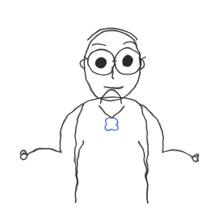
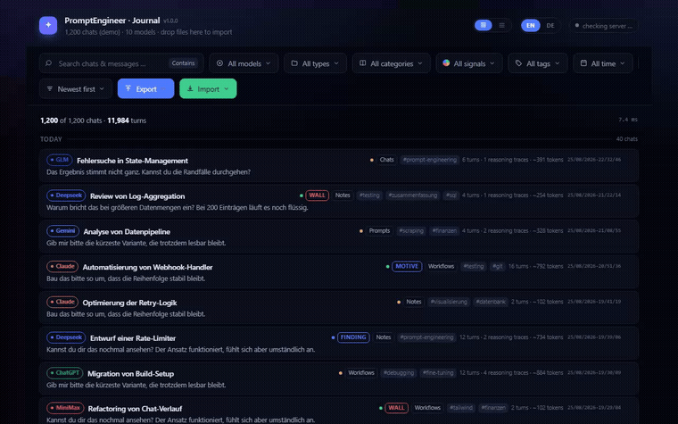
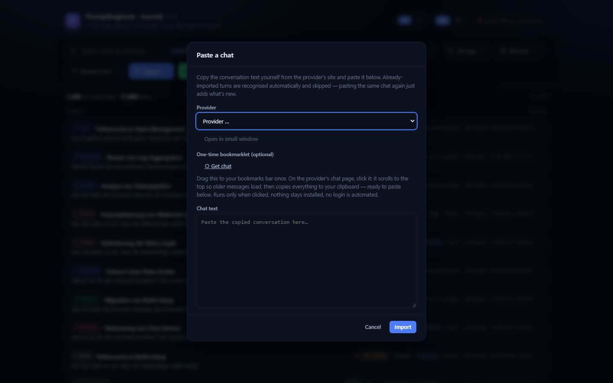

# PromptEngineer · Journal

**Your AI chat history, kept on your own disk — searchable, structured, and yours alone.**

> **Hi, I'm PromptPeter.** That's the face I made the day I counted 400-something ChatGPT
> conversations sitting in my browser history that I swore I'd revisit — the good prompt,
> the reasoning that actually worked, all of it gone the moment the tab closed. This repo
> is what I built instead of a 401st tab.

---

## Why this exists

You've had hundreds of conversations with ChatGPT, Claude, Gemini, and others. Somewhere
in there are the prompts that actually worked, the reasoning traces that explained *why*,
the dead ends you don't want to walk into twice. All of that lives scattered across
browser tabs you'll eventually lose.

**PromptEngineer Journal** turns your chat history into a permanent, searchable, local
archive — and treats the *reasoning*, not just the answer, as the thing worth keeping.

- **Nothing leaves your machine.** No account, no server, no cloud dependency that gets
  shut down next year. Open one HTML file, that's the whole app.
- **Nothing gets edited or deleted.** An entry, once logged, stays as evidence. Only its
  labels (tags, category, signal) can change — never the content.
- **Works across every model you use.** ChatGPT, Claude, Gemini, DeepSeek, Grok, Kimi,
  GLM, MiniMax, ManusAI, HuggingFace — one format, one journal, actually comparable.

---

## Quick start

**[Try it live](https://promptpeter.github.io/journal/)** — no install, runs straight in
your browser, loaded with the demo corpus from the screenshot above.

Or run it fully offline, same file either way:

1. Download or clone this repo
2. Double-click `index.html`
3. You're looking at a demo corpus already — filter it, click a card, explore the tree

To bring in your own chats, see [Getting your chats in](#getting-your-chats-in) below.

---

## What it does

**Real-time filtering.** Seven dimensions, freely combinable: full-text search with
eight operators, model, type, category, signal, tags, time range. Filtering 1,200 chats
(≈12,000 turns) takes under a tenth of a millisecond — fast enough to recompute on every
keystroke.

**Conversations as a tree.** Click an entry, it expands in place — no drawer, no context
switch. Each turn is a branch; reasoning traces (from models like DeepSeek-R1) hang
underneath as a collapsible third level.

**Eleven export formats.** Markdown, plain text, CSV, JSON, PDF, `raw.okf.json`,
`data.okf.json`, compacted OKF, age-decayed OKF, `VERLAUF.md`, and an **LLM wiki
bundle** — a ZIP that unpacks into a ready-to-use Obsidian vault.

**Secret scanning before every export.** API keys, tokens, connection strings, emails —
caught and optionally masked before anything leaves the app.

**Bilingual.** English by default, German fully available — a language switch, not two
codebases.

---

## Getting your chats in

Three ways, all manual by design, none of them a background service watching your
browser:

| Way | What it's for |
|---|---|
| **Paste a chat** | Copy the conversation text yourself, pick the provider, paste it in. Re-pasting the same (continued) conversation only adds what's new — nothing gets duplicated. |
| **Bookmarklet** | A one-click, one-time-run bookmark. On the provider's page, it scrolls to load the full history (most chat UIs lazy-load older messages) and copies the result to your clipboard. Drag it to your bookmarks bar once, in the "Paste a chat" dialog. |
| **Browser extension** (`extension/`) | Same scrolling logic, but delivers straight to an open Journal tab instead of the clipboard. Load unpacked via your browser's developer mode — see `extension/manifest.json`. |

Every path is provider-agnostic: it looks for the conversation area by shape (a wide
scroll region, not a narrow list sidebar), not by a provider's specific CSS classes —
so it doesn't break every time a provider redesigns their UI.

---

## The OKF format

Two layers, answering two different questions.

**`raw.okf.json`** — *what was said*: role, text, timestamp, model. Never modified.

**`data.okf.json`** — *what follows from it*. Each entry gets one of six types and may
point to an earlier entry, forming a graph of reasoning threads:

| Type | Shown as | Guiding question |
|---|---|---|
| `MOTIV` | Motive | Why are we doing this at all? |
| `FUND` | Finding | What is the case? |
| `WEG` | Path | What are we trying? |
| `WAND` | Wall | What did it run into? |
| `SETZUNG` | Decision | What holds now? |
| `ZWEIFEL` | Doubt | What is still nagging? |

A `MOTIV` is never compacted away. A path that hit a wall doesn't vanish — the wall
absorbs it along with the reasoning that led there. What's left, after compaction, is
the actual history of a project: motives, walls, decisions, open doubts — without the
repetition.

---

## Roadmap

Nothing below is started unless marked ✅. No promised dates — open source moves when it
moves.

- ✅ Filter engine, tree view, eleven export formats, OKF read/write
- ✅ Manual chat import: paste dialog, bookmarklet, browser extension — with duplicate
  detection
- ⬜ **Agent / Skill / Workflow / Prompt library** — take the snippets already sitting in
  your journal and turn them into reusable prompts, agent instructions, and workflows,
  without leaving the app
- ⬜ Logo and visual identity
- ⬜ Official data-export parsers (e.g. ChatGPT's `conversations.json`) as a fourth,
  higher-fidelity import path
- ⬜ Community-suggested formats, filters, and OKF types — see [Contributing](#contributing)

Have an idea that's not here? Open an issue — that's exactly what this list is for.

---

## Contributing

This is young, and it's meant to be shaped by the people who use it, not just by one
person's idea of what it should do. See [`CONTRIBUTING.md`](CONTRIBUTING.md) for how to
propose a change, report something broken, or pick up an open idea from the roadmap
above.

You don't need to be able to code to contribute — a good bug report, a UX complaint, or
a "here's a chat format your parser doesn't handle" is just as valuable as a pull
request.

---

## License

[MIT](LICENSE) — do what you want with it, including building a business on it. No
attribution required (though a mention is always appreciated), no share-alike clause,
no catch.

---

## Follow the thread

PromptPeter has social skills now — no idea how that happened either.

Reddit, YouTube, Instagram — brewing. This README updates the moment they exist.

Bug reports and "this broke on my chat export" reports travel fastest as a
[GitHub issue](../../issues) — everything else (a build screenshot, a stray idea at
1am, "does it handle *this* model") is exactly what the two links above are for.

---

## Background

This project grew out of `OKF_MD_LOG`, a server that transcribes AI conversations. Two
things changed its shape: the realisation that a model's *reasoning trace* is often more
useful than its answer, and the decision that looking something up shouldn't require
starting a server first. That second insight is this repo.

<em>PromptPeter keeps the thread. ⭐ if that face looks familiar.</em>

